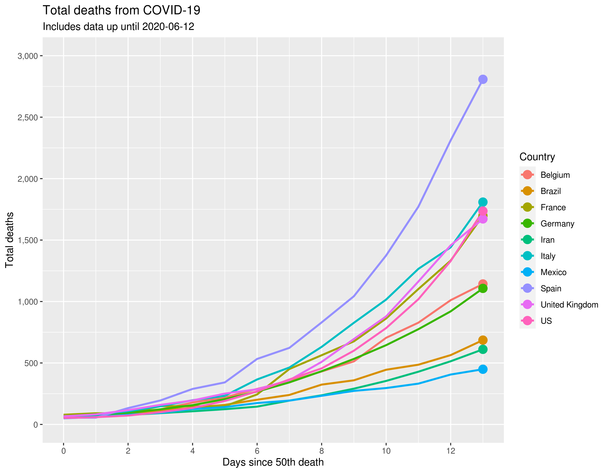
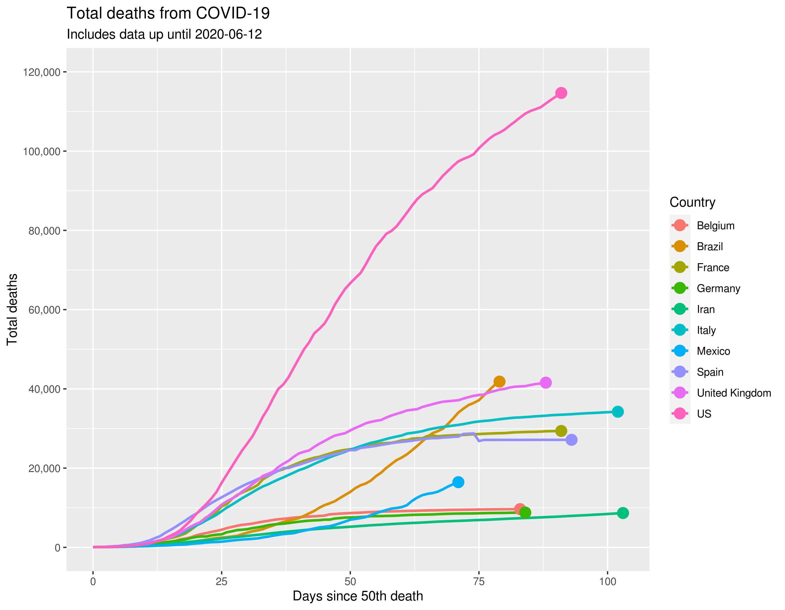
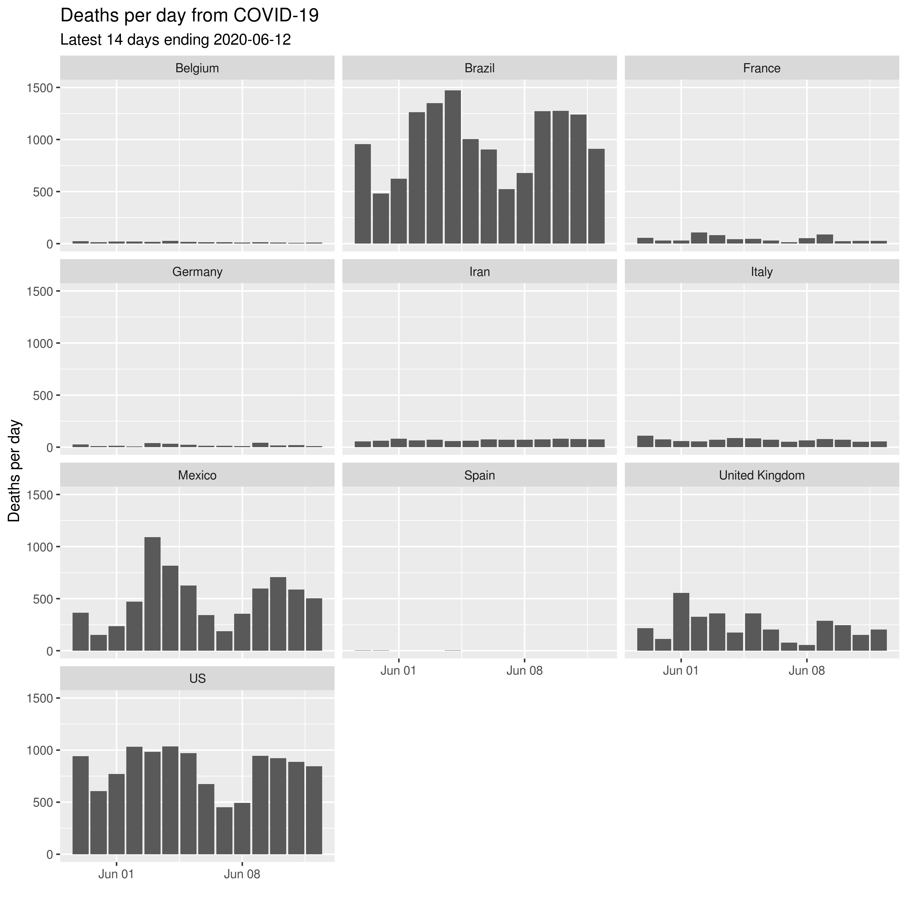

# COVID-19 Analysis

Analysis based on data from the [COVID-19 (2019-nCoV) Data Repository by Johns Hopkins CSSE](https://github.com/CSSEGISandData/COVID-19). See R code in `src/analysis.R`. Run on R 3.6.3 for Windows with Tidyverse 1.3.0.

